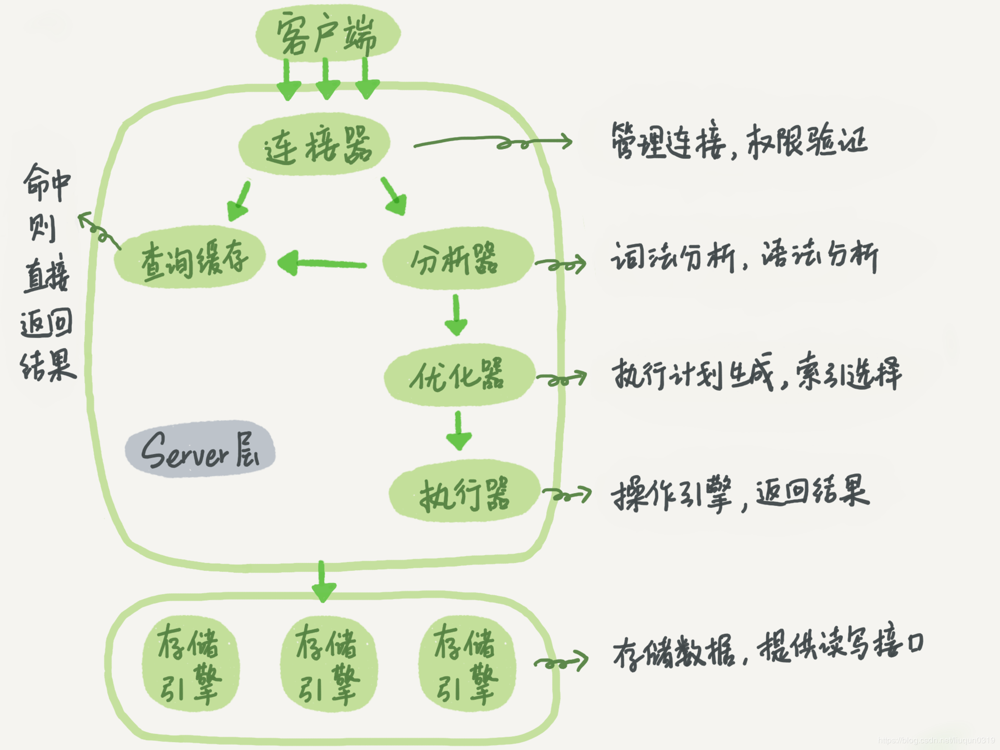

[TOC]
## 通用模块
### 查询内部执行过程

- mysql的架构结构
    - Server层(连接器、缓存、分析器、优化器、执行器)
    - 存储引擎(存储、提取)，架构模式是插件式
- 连接器主要功能
    - 客户端连接，获取权限，维持和管理连接
    - 如何优化mysql连接过程中的资源消耗
- mysql查询表的权限是在那一步验证(执行器)
### 查询缓存
- 如何打开mysql查询缓存
- 缓存的命中
- 缓存权限的校验
- 查询缓存的淘汰机制
- 如何数据表被锁住，缓存中的数据能否返回
- 为啥mysql8把查询缓存废弃掉(缓存淘汰太大)
### 表空间
- 表空间分类(共享、独立)
- 对应的表空间的优缺点
### 前置索引
- 前缀索引的优缺点
    - 优点前缀索引占用空间更小，缺点是不支持order by 或 group by 

### 回表查询
- 什么是回表查询？什么是索引覆盖？如何实现索引覆盖？哪些场景可以用来索引覆盖优化sql？
    - 将被查询的字段，建立到联合索引里去，能实现索引覆盖
- 什么是聚集索引？与普通索引有啥区别？ 
    - 聚集索引叶子节点会存储记录，innodb必须有且仅有一个聚集索引
    - 普通索引叶子节点存储主键值
- explain
    - select_type 就是select类型
        - simple 简单select查询(不使用union或子查询)
        - primary 最外层的查询
        - union 第二个或后面的查询
        - subquery 第一个子查询
    - type 显示连接使用了那种类别，有无使用索引，（const->eq_reg->ref->range->index->all）
    - possible_keys 使用哪个索引能再该表中找到行
    - rows 执行查询时执行的行数

### 数据类型间的区别
- 数值
    - 手机号码应如何存储？
    - 金额类型的数据应该如何存储？
    - 时间格式应如何存储？
    - 图片地址路径信息如何存储？
    - mp3,图片一般都存储路径，使用blob二进制类型文件
- 日期/时间
- 字符串
- 删除表的几种方式与性能对比
    - drop table table_name 释放空间
    - truncate table table_name  不能操作关联视图的表数据
    - delete from table where ...
- 枚举
    - enum的优确点？为啥要用tinyint代替enum?仅仅是为了移值性吗？
- count(1)/count(*)/count(字段)性能对比
    - count(主键)性能最优，count(1)与count(*)差不多，统计的数据都会把对应的列统计进去。
    - count(列名)，统计的数据会忽略对应的null的数据
### 视图
### 删除数据恢复原理分析
### 数据引擎
### 数据结构

## 索引模块
### 模糊查询与索引
### 唯一索引和普通索引的性能对比
### 聚集索引与非聚集索引
### 最左匹配原则
### 存储算法
### 前缀索引
### 优化器跟如何使用索引
### 不使用索引的原因列举

## 事务模块
### 事务的特性
### 脏读/幻读
### 不可重复读
### 事务隔离
### 并发事务
### 事务实现原理

## 锁
### 死锁的案例
### 全局锁/表锁/行锁
### 乐观锁/悲观锁
### 排它锁
### 优化锁

## 日志
### 错误日志
### 查询日志
### 慢日志
### redo log(重做日志)
### bin log(归档日志)
### undo log(回滚日志)

## 操作命令和内置函数
### 服务器操作
### 服务运行状态
### 执行统计
### 用户授权
### 库表设置
### 删除的N种方式

## 性能优化和分布式
### 慢查询的排除
### 读写分离
### 主备无延迟
### 多实例配置
### 水平分区
### 性能分析

## 开放性问题
### 千万级表优化
### 线上操作隐患
### 故障排除
### 高性能服务器设计